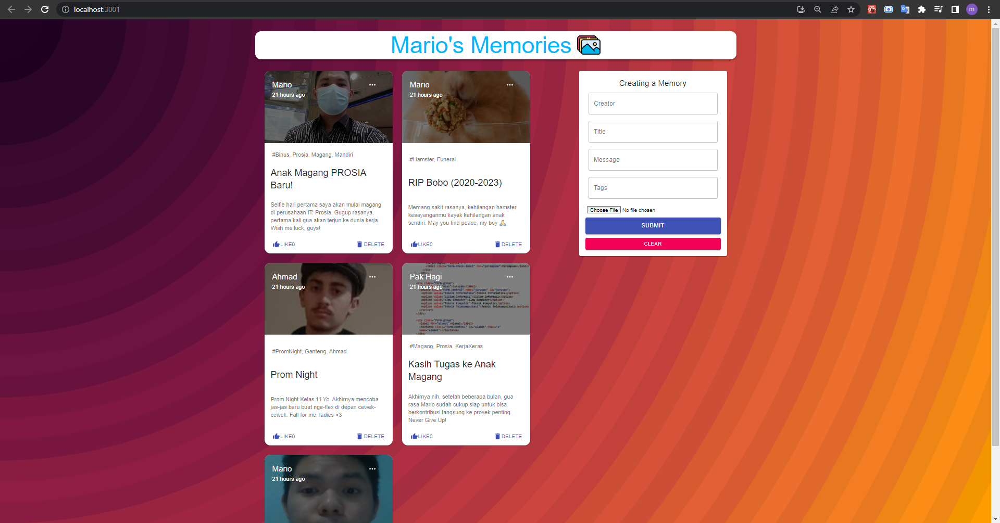

# Social Media - Memories

A mini social media project where I first practiced implementing CRUD Operations using MongoDB Atlas, in other words, MERN stack. This is still in the middle of the 2nd tutorial video, where only the Create and Read operations have been made, no Update nor Delete yet.

Project made by Mario (with some of my own code modifications).

---

Some screenshots:

---

The tutorial video can be found [here](https://www.youtube.com/playlist?list=PL6QREj8te1P7VSwhrMf3D3Xt4V6_SRkhu).

